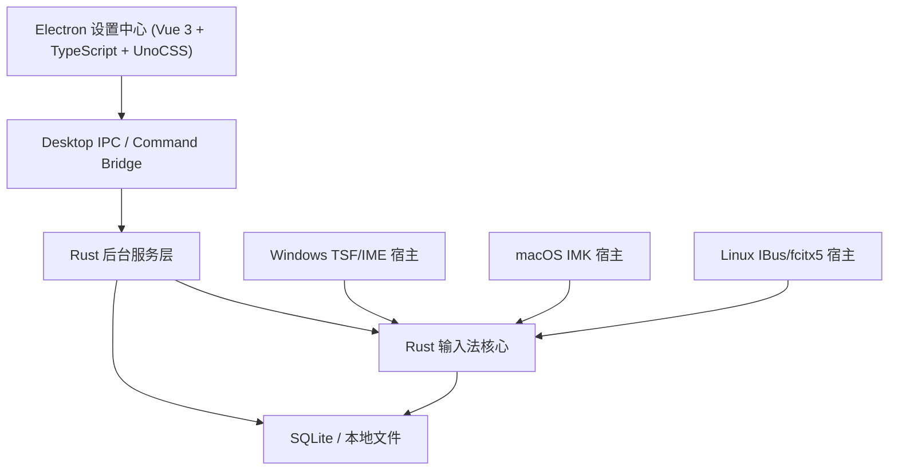
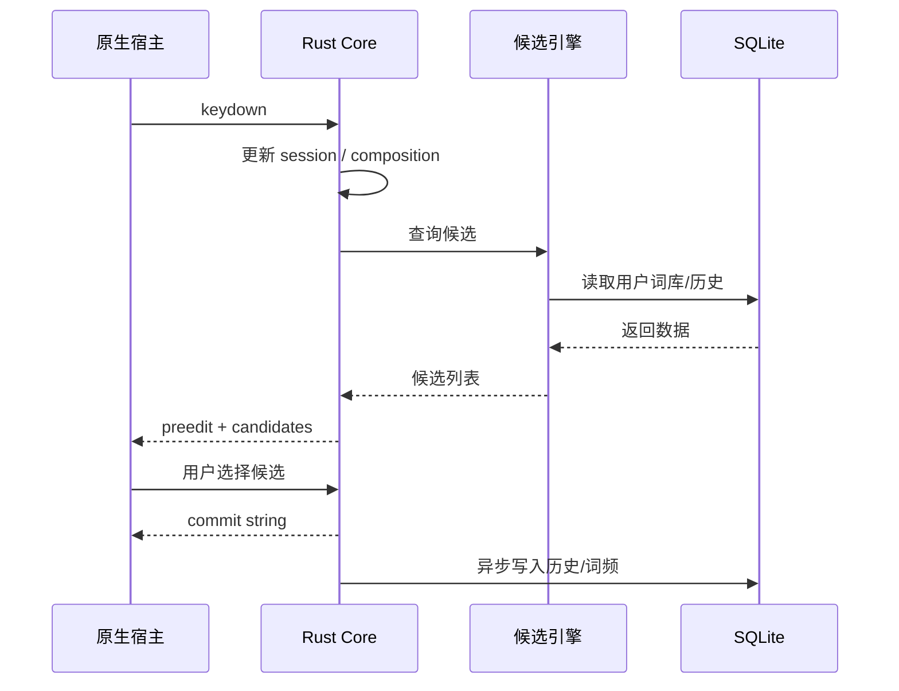

# 跨平台 PC 输入法架构设计

## 1. 目标与关键结论

本项目的目标是构建一款支持 Windows、macOS、Linux 的桌面输入法，提供高性能文本输入、候选词选择、自定义词库、历史学习、快捷键与可扩展输入方案。

关键架构结论：

1. Electron + Vue 3 不直接承担系统级输入法宿主职责，而是作为“设置中心 + 调试工具 + 词库管理器 + 日志查看器”。
2. 真正接入系统输入链路的部分必须使用各平台原生输入法框架：
   - Windows：TSF / IME
   - macOS：Input Method Kit
   - Linux：IBus 为主，预留 fcitx5 适配层
3. Rust 作为共享核心，统一处理输入状态机、分词转换、候选生成、用户词频学习、配置加载、SQLite 持久化与日志采集。
4. 系统输入法宿主、后台服务、Electron 设置中心共享同一套 Rust Core 和数据模型，避免三端逻辑分裂。

## 2. 总体分层



### 2.1 推荐仓库结构

```text
shurufa/
  apps/
    desktop-settings/          # Electron + Vue 3 设置中心
  packages/
    shared-types/              # TS/Rust 共享 schema 生成结果
    shared-ui/                 # 可复用 Vue 组件
  rust/
    crates/
      ime-core/                # 输入法状态机、候选生成、学习策略
      ime-dict/                # 系统词库/用户词库/导入导出
      ime-config/              # 配置模型与校验
      ime-db/                  # SQLite 访问层
      ime-logging/             # 日志、诊断事件、trace
      ime-ipc/                 # Electron/守护进程 IPC
      ime-platform-api/        # 平台无关宿主接口
      ime-service/             # 后台服务进程
    native/
      windows-tsf/             # TSF/IME 宿主
      macos-imk/               # IMK 宿主
      linux-ibus/              # IBus 引擎
      linux-fcitx5/            # 可选，第二阶段
  docs/
    ime-architecture.md
```

## 3. 主要功能模块设计

## 3.1 用户设置模块

职责：

- 输入方案配置：拼音、五笔、英文直通、扩展方案启停
- 外观配置：候选框字号、主题、透明度、布局、跟随光标策略
- 行为配置：中英文切换、模糊音、自动上屏、联想开关、翻页方式
- 快捷键配置：切换输入法、切换方案、选择候选、翻页、快捷短语
- 数据管理：导入导出配置、重置配置、同步预留

实现要点：

- 前端通过 Electron IPC 调用 Rust `ime-config` 服务。
- 配置变更写入 SQLite，并通过事件总线广播给宿主进程和设置中心。
- 使用版本化配置结构，便于后续迁移。

## 3.2 输入历史模块

职责：

- 记录用户最近输入的词、短语、时间、来源输入方案
- 生成高频词和最近词推荐
- 支持按天清理、按词删除、全部清空

实现要点：

- 输入提交成功后由 Rust Core 异步写入历史表，避免阻塞上屏。
- 高频词与最近词采用两类索引：
  - `last_used_at`
  - `usage_count`
- 历史记录不仅用于 UI 展示，也作为候选排序训练特征。

## 3.3 词库管理模块

职责：

- 系统基础词库
- 用户自定义词库
- 短语模板与快速文本片段
- 第三方词库导入导出
- 热更新词库，无需重启输入法

实现要点：

- 系统词库使用只读词典文件或 SQLite 只读表。
- 用户词库放入 SQLite，可增删改查。
- 大词库检索使用前缀索引、双数组 Trie、FST 或内存缓存索引。
- 导入时先写入临时表并做校验，再切换到正式表。

## 3.4 快捷键管理模块

职责：

- 候选选择键：`1..9`、`Space`、`Enter`
- 翻页键：`,` `.` `[` `]` 或自定义
- 中英文切换：`Shift`、`Ctrl+Space` 等
- 快速短语展开：如 `/addr`、`;mail`

实现要点：

- 快捷键分为三类：
  - 输入法内部按键
  - 宿主框架层热键
  - Electron 设置中心快捷键
- 必须建立冲突检测机制，防止与系统和应用热键冲突。

## 3.5 调试与诊断模块

职责：

- 展示当前输入上下文、组合串、候选列表、上屏结果
- 查看错误日志、性能埋点、数据库状态
- 一键导出诊断包

实现要点：

- Rust `tracing` 统一采集日志。
- 设置中心通过 IPC 拉取最近日志和运行时指标。
- 对隐私内容做脱敏，可配置是否记录用户原始输入。

## 4. 前端界面模块设计

## 4.1 Electron 应用定位

Electron 应用负责：

- 设置中心
- 词库管理
- 历史查看
- 日志与诊断
- 托盘菜单
- 自动更新与版本管理

Electron 不直接承担：

- 任意应用中的系统输入拦截
- 原生候选窗跟随光标绘制
- 系统输入法注册与切换

## 4.2 Vue 3 页面模块

### A. 设置首页 Dashboard

- 当前输入法状态
- 各输入方案启用状态
- 最近错误数、词库条目数、用户词频统计

### B. 输入方案设置页

- 拼音规则
- 五笔规则
- 模糊音开关
- 自动联想
- 自动上屏策略

### C. 候选词与界面设置页

- 候选条数
- 横排/竖排
- 字体、字号、圆角、主题
- 跟随光标策略

### D. 词库管理页

- 自定义词新增/编辑/删除
- 批量导入导出
- 第三方词库启停
- 快速文本片段管理

### E. 快捷键管理页

- 候选选择键位映射
- 输入法切换快捷键
- 全局/局部热键冲突提示

### F. 输入历史页

- 最近输入
- 高频输入
- 搜索、删除、清空

### G. 调试与日志页

- 当前会话事件流
- 错误栈
- 平均候选耗时
- 数据库健康检查

## 4.3 候选词面板设计

候选词面板分两种实现：

1. 系统宿主原生候选窗
2. 自绘候选窗

建议：

- Windows 和 macOS 优先复用原生输入法候选 API 或原生窗口。
- Linux 视 IBus/fcitx5 能力选择原生候选或自绘补充。
- 自绘 UI 样式由 Rust 宿主控制，视觉参数从 SQLite 配置读取。

候选项结构：

```ts
interface CandidateItem {
  id: string
  text: string
  annotation?: string
  score: number
  source: 'system_dict' | 'user_dict' | 'history' | 'snippet' | 'plugin'
  hotkey?: string
}
```

## 5. 输入法核心逻辑模块

核心原则：输入链路必须是同步感知、异步持久化、低延迟返回。

## 5.1 Core 子模块划分

### A. Input Session Manager

职责：

- 管理每个焦点输入上下文的会话状态
- 维护组合串、光标位置、已选择候选、模式状态

核心状态：

- `raw_keys`
- `composition_text`
- `preedit_segments`
- `candidates`
- `selected_index`
- `input_mode`
- `schema_id`

### B. Key Event Processor

职责：

- 解析按键事件
- 判定按键属于输入、功能键、翻页键、确认键还是取消键
- 输出状态迁移命令

输入：

- 物理按键
- 修饰键状态
- 当前 session 状态

输出：

- 更新组合串
- 更新候选
- 上屏文本
- 清空会话
- 切换输入法状态

### C. Composition Engine

职责：

- 将原始输入映射为编码串
- 根据输入方案生成预编辑文本
- 处理拼音切分、五笔编码、扩展输入协议

### D. Candidate Engine

职责：

- 查询系统词库
- 查询用户词库
- 查询历史高频
- 合并候选并排序

候选排序特征：

- 精确匹配优先
- 用户词频
- 最近使用时间
- 词长
- 上下文联想
- 方案优先级

### E. Commit Engine

职责：

- 确认上屏文本
- 向宿主返回 commit string
- 异步触发学习、历史记录、词频更新

### F. Mode Manager

职责：

- 中英文切换
- 半角全角切换
- 简繁切换
- 输入方案切换

## 5.2 典型输入流程



## 5.3 文本转换与候选策略

### 拼音

- 支持全拼、双拼、模糊音、简拼
- 使用分词器把输入串切分为多个音节组合
- 候选合并时优先用户习惯词

### 五笔

- 直接按编码查词
- 支持容错、末码补全、词组联想

### 快速文本输入

- 通过 snippet 前缀快速展开
- 支持变量模板，如日期、时间、邮箱、地址

### 扩展输入方式

- 通过 `InputSchemaPlugin` 接口挂载
- 语音、手写、OCR 可以作为候选来源接入，而不破坏主状态机

建议插件接口：

```rust
pub trait InputSchemaPlugin {
    fn id(&self) -> &'static str;
    fn can_handle(&self, session: &SessionState) -> bool;
    fn update(&mut self, event: KeyEvent, session: &SessionState) -> PluginResult;
    fn list_candidates(&self, session: &SessionState) -> Vec<Candidate>;
}
```

## 6. 输入法与系统的集成方式

## 6.1 Windows

建议优先级：TSF > 传统 IME。

原因：

- TSF 与现代 Windows 文本服务兼容性更好
- 更容易处理文本上下文、候选 UI、状态栏、语言栏
- 对富文本编辑器和 Office/浏览器兼容性更优

模块设计：

- `windows-tsf` 负责 COM 注册、文本服务激活、焦点上下文管理
- 接收按键后转给 Rust Core
- 将 Rust 返回的 `preedit`、`candidate list`、`commit` 映射为 TSF API 调用

关键能力：

- `ITfTextInputProcessor`
- `ITfThreadMgr`
- `ITfContext`
- `ITfCandidateListUIElement`

建议：

- Windows 先做 TSF 主实现
- 传统 IMM/IME 兼容放在后续里程碑

## 6.2 macOS

使用 Input Method Kit。

模块设计：

- `macos-imk` 使用 Objective-C/Swift 桥接到 Rust 动态库
- 每个输入上下文维护一个 `SessionState`
- 候选窗使用 IMK Candidate API 或原生窗口承载

关键职责：

- 处理 `handleEvent`
- 更新 marked text
- 返回 committed text
- 候选框与光标跟随

建议：

- 宿主层用 Swift/Objective-C
- 核心逻辑用 Rust 静态库或动态库
- 使用 C ABI 或 UniFFI 做桥接

## 6.3 Linux

推荐路线：

1. 第一阶段支持 IBus
2. 第二阶段增加 fcitx5

原因：

- IBus 文档和桌面环境适配面更清晰
- fcitx5 生态更强，但适配成本更高

模块设计：

- `linux-ibus` 实现 IBus Engine
- 将按键事件传入 Rust Core
- 返回 preedit、auxiliary text、lookup table

关键点：

- 不同桌面环境下候选框定位行为可能不同
- Wayland/X11 行为差异需要单独测试

## 6.4 平台统一抽象

Rust 定义统一宿主接口：

```rust
pub trait PlatformHost {
    fn update_preedit(&self, preedit: PreeditState);
    fn update_candidates(&self, candidates: CandidatePage);
    fn commit_text(&self, text: &str);
    fn clear_session(&self);
    fn set_mode_indicator(&self, mode: InputMode);
}
```

这样 Core 只关心业务，不关心 TSF/IMK/IBus 细节。

## 7. 数据存储与管理

## 7.1 存储分层

### SQLite

适合保存：

- 用户配置
- 用户词库
- 输入历史
- 候选学习数据
- 调试日志索引

### 本地文件

适合保存：

- 大型只读系统词库
- 导入导出的词库文件
- 日志归档文件
- 主题资源与扩展包

### IndexedDB

仅在 Electron 渲染进程中作为 UI 缓存可选项，不作为核心真相源。

建议：

- 真实业务数据以 SQLite 为准
- IndexedDB 只用于前端临时缓存筛选结果或大列表分页状态

## 7.2 SQLite 表设计建议

```sql
CREATE TABLE app_config (
  key TEXT PRIMARY KEY,
  value_json TEXT NOT NULL,
  updated_at INTEGER NOT NULL
);

CREATE TABLE input_schema (
  id TEXT PRIMARY KEY,
  type TEXT NOT NULL,
  enabled INTEGER NOT NULL DEFAULT 1,
  config_json TEXT NOT NULL,
  updated_at INTEGER NOT NULL
);

CREATE TABLE user_dictionary (
  id INTEGER PRIMARY KEY AUTOINCREMENT,
  schema_id TEXT NOT NULL,
  code TEXT NOT NULL,
  word TEXT NOT NULL,
  weight REAL NOT NULL DEFAULT 1,
  source TEXT NOT NULL DEFAULT 'manual',
  created_at INTEGER NOT NULL,
  updated_at INTEGER NOT NULL
);

CREATE INDEX idx_user_dictionary_lookup
ON user_dictionary(schema_id, code, weight DESC);

CREATE TABLE input_history (
  id INTEGER PRIMARY KEY AUTOINCREMENT,
  schema_id TEXT NOT NULL,
  input_code TEXT NOT NULL,
  committed_text TEXT NOT NULL,
  usage_count INTEGER NOT NULL DEFAULT 1,
  last_used_at INTEGER NOT NULL,
  created_at INTEGER NOT NULL
);

CREATE INDEX idx_input_history_lookup
ON input_history(schema_id, input_code, last_used_at DESC);

CREATE TABLE snippets (
  id INTEGER PRIMARY KEY AUTOINCREMENT,
  trigger TEXT NOT NULL UNIQUE,
  content TEXT NOT NULL,
  description TEXT,
  updated_at INTEGER NOT NULL
);

CREATE TABLE hotkeys (
  id TEXT PRIMARY KEY,
  action TEXT NOT NULL,
  accelerator TEXT NOT NULL,
  scope TEXT NOT NULL,
  enabled INTEGER NOT NULL DEFAULT 1,
  updated_at INTEGER NOT NULL
);

CREATE TABLE error_logs (
  id INTEGER PRIMARY KEY AUTOINCREMENT,
  level TEXT NOT NULL,
  module TEXT NOT NULL,
  message TEXT NOT NULL,
  context_json TEXT,
  created_at INTEGER NOT NULL
);
```

## 7.3 数据访问策略

- 高频查询路径采用只读连接池或单写多读模式
- 用户词频更新采用批量 flush，避免每次上屏都立即写盘
- 启动阶段加载：
  - 热门用户词
  - 最近输入
  - 基础配置
- 大词库使用 mmap 或二进制索引文件，避免全部装入 SQLite

## 8. 配置管理与持久化

## 8.1 配置模型

配置分级：

1. 全局配置
2. 输入方案配置
3. UI 配置
4. 快捷键配置
5. 调试配置

建议结构：

```ts
interface AppConfig {
  general: {
    startupWithSystem: boolean
    locale: string
  }
  input: {
    defaultSchema: string
    englishModeByDefault: boolean
    candidatePageSize: number
  }
  appearance: {
    theme: 'light' | 'dark' | 'system'
    fontSize: number
    candidateLayout: 'horizontal' | 'vertical'
  }
  logging: {
    level: 'error' | 'warn' | 'info' | 'debug' | 'trace'
    redactInputContent: boolean
  }
}
```

## 8.2 配置同步机制

目标：多个窗口、后台服务、原生宿主共享一致配置。

方案：

- SQLite 为持久化真相源
- Rust `ime-service` 持有内存态配置快照
- Electron 修改配置后通过 IPC 请求 service 更新
- service 写库成功后广播配置版本号
- 各宿主收到广播后热更新本地配置缓存

广播方式可选：

- 本机 socket
- named pipe
- platform channel
- SQLite `config_version` 轮询兜底

## 8.3 导入导出

支持导出内容：

- 全量配置 JSON
- 用户词库 TSV/CSV/JSON
- 快速短语
- 调试日志包

导入流程：

1. 文件校验
2. 版本检测
3. 临时表导入
4. 冲突检查
5. 正式覆盖或合并

## 9. 错误日志与调试

## 9.1 日志分层

### 运行日志

- 宿主启动
- 会话创建
- 候选生成耗时
- 上屏结果

### 错误日志

- 平台 API 调用失败
- 数据库损坏
- 配置解析失败
- 插件加载失败

### 性能日志

- 按键到候选生成耗时
- 候选排序耗时
- SQLite 查询耗时

## 9.2 推荐日志方案

- Rust：`tracing` + `tracing-subscriber`
- Electron 主进程：结构化 JSON 日志
- Vue 渲染进程：前端错误边界 + IPC 上报

日志输出位置建议：

- 滚动日志文件
- SQLite `error_logs` 表索引
- 调试模式实时事件流

## 9.3 调试界面能力

- 查看最近 N 条错误
- 按模块筛选
- 导出日志 zip
- 清空日志
- 查看当前会话快照

## 10. 性能设计

## 10.1 延迟目标

- 单次按键到候选展示：目标 < 10ms，本地缓存命中场景 < 5ms
- 候选确认到上屏：目标 < 4ms
- 热词学习写盘：异步，不阻塞主链路

## 10.2 优化策略

- 前缀匹配索引常驻内存
- 候选排序使用轻量特征模型，不在主链路做重计算
- 写库采用队列批量提交
- UI 与核心分进程，避免 Electron 卡顿影响输入
- 只为活跃 session 保持状态

## 10.3 资源控制

- 词库分层缓存，冷数据按需读取
- 限制历史记录保留窗口
- 日志滚动归档
- 自定义词导入分块处理

## 11. 可扩展性设计

## 11.1 插件扩展点

可扩展类型：

- 新输入方案
- 第三方词库提供器
- 快速文本模板提供器
- 语音输入适配器
- OCR/手写识别适配器

建议设计：

- Rust Core 暴露稳定插件 trait
- 插件配置统一进 SQLite
- Electron 提供插件启停和权限管理

## 11.2 第三方词库集成

支持来源：

- 本地文件导入
- 在线词库下载
- 企业定制词库包

词库管理策略：

- 每个词库单独记录版本与来源
- 支持启停、优先级、冲突消解

## 12. 开发阶段建议

## Phase 1：可运行最小闭环

- Rust Core
- SQLite 配置/词库/历史
- Electron 设置中心
- Windows TSF 打通基本拼音候选与上屏

## Phase 2：增强输入体验

- 用户词频学习
- 快捷短语
- 候选 UI 定制
- 日志中心

## Phase 3：多平台扩展

- macOS IMK
- Linux IBus
- 导入导出
- 第三方词库

## Phase 4：高级能力

- fcitx5
- 插件系统
- 语音/手写扩展
- 配置同步

## 13. 风险与注意事项

1. 输入法是系统级软件，Windows/macOS/Linux 的打包、签名、注册、权限与安装流程远比普通 Electron 应用复杂。
2. 候选窗跟随光标、不同编辑器兼容性、Wayland 行为差异，是跨平台输入法最容易出现兼容问题的区域。
3. Electron 不应进入按键主链路，否则一旦渲染进程卡顿会直接影响输入体验。
4. SQLite 非常适合配置和用户词库，但大型系统词库建议使用专门索引文件，不要把所有基础词典全塞进 SQLite。
5. 插件和日志必须注意隐私边界，避免默认记录完整敏感输入内容。

## 14. 推荐的最终架构结论

最适合本项目的落地方式是：

- Electron + Vue 3 + TypeScript + UnoCSS：设置中心、词库管理、历史与日志界面
- Rust Core：输入状态机、候选生成、排序、学习、SQLite 持久化
- Rust Service：配置广播、日志聚合、后台数据任务
- Native Host：
  - Windows：TSF
  - macOS：IMK
  - Linux：IBus，后续加 fcitx5
- SQLite：用户配置、用户词库、历史、热词、日志索引
- 文件词典：大型基础词库、导入导出包、日志归档

这样的架构既满足跨平台，又能保证系统级输入法需要的性能、可维护性与可扩展性。
